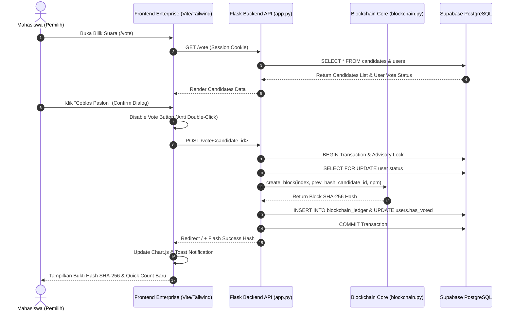

# VoteChain — Enterprise E-Voting & SHA-256 Hash-Chain Platform

[](https://github.com/Whit3knight/Vote-chain)
[](https://tailwindcss.com/)
[](https://flask.palletsprojects.org/)
[](https://supabase.com/)
[](https://vercel.com/)
[](LICENSE)

---

## 1. Latar Belakang & Student's Log (Separation of Concerns)

VoteChain adalah platform e-voting mahasiswa berbasis kriptografi hash-chain SHA-256 yang menjamin integritas data pemungutan suara secara real-time. Pada iterasi ini, dilakukan perancangan ulang arsitektur antarmuka pengguna (Frontend Enterprise-Ready) dengan menerapkan arsitektur terpisah (*decoupled architecture*). 

Dalam arsitektur ini, seluruh kode backend (`app.py`, `blockchain.py`, `db.py`, `schema.sql`) diperlakukan sebagai modul *immutable* yang tidak boleh diubah. Sisi Frontend bertanggung jawab penuh mengonsumsi REST API, mengelola *state* antarmuka, menyajikan visualisasi analitik suara, serta menyajikan pengalaman otentikasi dan pencoblosan yang aman dan responsif.

---

## 2. Fitur Utama (Key Features)

- **Enterprise Authentication & Access Guard**: Sistem otentikasi terintegrasi dengan proteksi sesi berbasis peran (*Admin* vs *Pemilih*).
- **Interactive Quick Count & Real-Time Analytics Dashboard**: Visualisasi perolehan suara *real-time* menggunakan grafik batang dan *doughnut* dari Chart.js.
- **E-Voting Experience & One-Vote Enforcer**: Antarmuka bilik suara resmi dengan proteksi *anti double-click* dan konfirmasi dialog.
- **Candidate Management Hub (Admin CRUD)**: Modul manajerial untuk menambah, mengubah, dan menghapus kandidat dengan proteksi data suara.
- **SHA-256 Hash Chain Real-Time Verifier**: Modul verifikasi kriptografi yang menghitung ulang (*re-compute*) seluruh rantai blok di server secara otomatis.
- **Instant SHA-256 Hash Lookup & Inspector Tool**: Alat pencarian interaktif untuk memeriksa 64 hex hash via REST API `/api/cek-hash`.
- **Immutable Audit Ledger Explorer**: Penjelajah log transaksi audit lengkap dari *Genesis Block* hingga blok terkini.
- **System Health & DB Connectivity Monitoring Panel**: Panel pemantauan status konektivitas Supabase PostgreSQL dan *live ping* backend via `/status`.

---

## 3. Diagram Alur Integrasi (Mermaid.js Sequence Diagram)



---

## 4. Arsitektur Integrasi System

```text
[ Browser / Client Frontend ]
       │
       ├─ HTML5 / Jinja2 Enterprise Layout
       ├─ Tailwind CSS (Dark Slate Enterprise Theme)
       ├─ Lucide Icons & Inter/Outfit Google Fonts
       ├─ Chart.js Real-time Analytics Visualizer
       └─ Fetch / Form Submissions (Credentials: include)
       │
       ▼ HTTP Request (REST / Session Cookie)
[ Flask Backend Engine (app.py) ]
       │
       ├─ Auth Guards (@login_required, @admin_required)
       ├─ Transaction Lock (pg_advisory_xact_lock)
       ├─ SHA-256 Re-computation Engine (blockchain.py)
       └─ Database Handler (db.py)
       │
       ▼ PostgreSQL Protocol (TLS Encrypted)
[ Supabase PostgreSQL Online Database ]
       ├─ Table: users (npm, nama, password_hash, role, has_voted)
       ├─ Table: candidates (id, nama_paslon, visi_misi, foto)
       └─ Table: blockchain_ledger (block_index, prev_hash, candidate_id, voter_npm, timestamp, current_hash)
```

---

## 5. Panduan Instalasi Lokal & Deployment Vercel

### 5.1 Instalasi & Jalankan Lokal

1. Clone repositori proyek:
   ```bash
   git clone https://github.com/Whit3knight/Vote-chain.git
   cd Vote-chain
   ```

2. Buat lingkungan virtual Python dan pasang dependensi:
   ```bash
   python3 -m venv .venv
   source .venv/bin/activate
   pip install -r requirements.txt
   ```

3. Salin dan sesuaikan variabel lingkungan:
   ```bash
   cp .env.example .env
   ```

4. Jalankan server aplikasi:
   ```bash
   python app.py
   ```
   Aplikasi akan berjalan di `http://127.0.0.1:5000`.

### 5.2 Deployment ke Vercel

Sistem telah dilengkapi dengan konfigurasi `vercel.json` dan `package.json` yang siap di-deploy langsung ke Vercel Serverless:

```bash
npx vercel --prod
```

Variabel lingkungan yang wajib diatur di Dashboard Vercel:
- `DATABASE_URL`: PostgreSQL Connection String Supabase.
- `SECRET_KEY`: Random Secret Key untuk Flask Session.

---

## 6. Struktur Direktori Proyek

```text
Vote-chain/
├── app.py                 # Core Flask backend routes & API handlers
├── blockchain.py          # SHA-256 hash calculation & chain validator
├── db.py                  # Supabase PostgreSQL database connection pool
├── schema.sql             # Database DDL schema definitions
├── requirements.txt       # Python runtime dependencies
├── vercel.json            # Vercel deployment configuration
├── package.json           # Frontend build scripts & metadata
├── .env.example           # Environment variables template
├── .gitignore             # Ignored tracking rules
├── README.md              # Technical documentation
├── templates/             # Enterprise UI HTML Jinja2 Templates
│   ├── base.html          # Master layout with navigation & toast system
│   ├── index.html         # Dashboard & Chart.js quick count visualizer
│   ├── login.html         # Enterprise authentication login form
│   ├── register.html      # Voter registration form
│   ├── vote.html          # E-voting ballot booth interface
│   ├── verifikasi.html    # SHA-256 hash verifier & inspector tool
│   ├── ledger.html        # Immutable audit ledger explorer
│   ├── kandidat_list.html # Candidate management table
│   └── kandidat_form.html # Candidate add/edit form
├── static/                # Static web assets
│   ├── css/style.css      # Enterprise CSS & glassmorphism utilities
│   └── js/app.js          # Anti-double click handler & clipboard copy
└── hasil/                 # Academic UAS Report & Evidence Assets
    ├── main.tex           # LaTeX source document
    ├── Laporan_UAS_PemrogramanWeb_24.83.1107.pdf
    └── *.png              # Full-page screenshots & GitHub contribution proofs
```

---

## 7. Tabel Kontributor & Pembagian Tugas

| Nama Anggota | NIM | Peran & Tanggung Jawab Utama |
|--------------|-----|------------------------------|
| **Fransiscus Asisi Kananda Herdion Dharmawan** | **24.83.1107** | **Modern Enterprise Frontend Development, UI/UX Redesign, API Consumption, Vercel Deployment, & LaTeX Documentation** |
| Kelompok Whit3knight | - | Backend Engine, Blockchain Hashing Core, & Supabase Database Architecture |

---

## 8. Lisensi

Hak Cipta (c) 2026 Fransiscus Asisi Kananda Herdion Dharmawan — Universitas Amikom Yogyakarta. Lisensi MIT.
